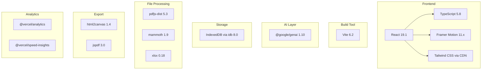
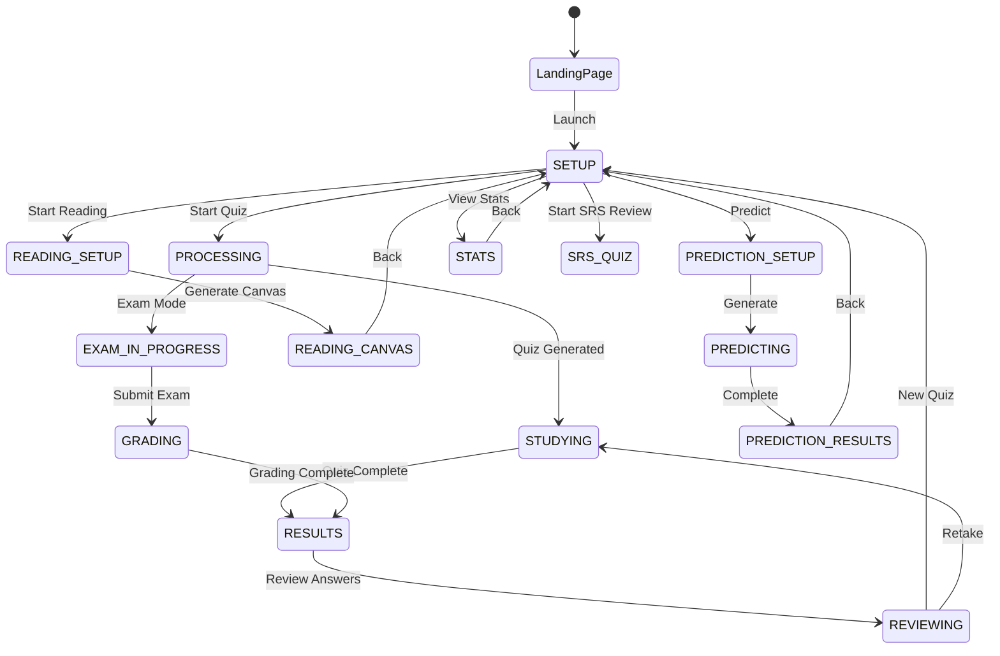
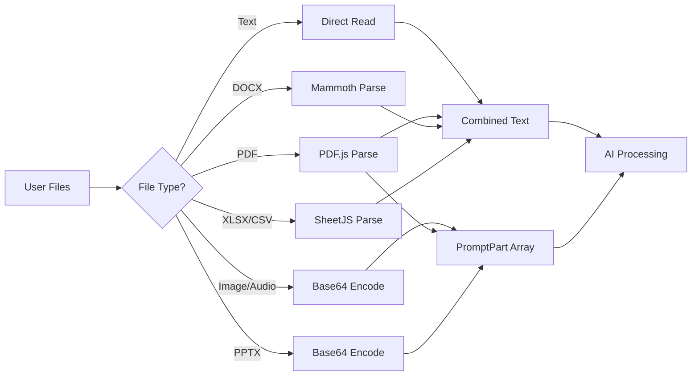

# Adaptive Study Game - Comprehensive Feature Documentation

> **Purpose**: This document provides a complete inventory of all features, components, services, and architectural patterns in the Adaptive Study Game application. It is designed to serve as a migration blueprint for porting to Next.js (web) and Expo (mobile).

---

## Table of Contents

1. [Application Overview](#1-application-overview)
2. [Tech Stack Analysis](#2-tech-stack-analysis)
3. [Architecture Overview](#3-architecture-overview)
4. [Screen Inventory](#4-screen-inventory)
5. [Component Inventory](#5-component-inventory)
6. [AI Service Layer](#6-ai-service-layer)
7. [Data Layer & Persistence](#7-data-layer--persistence)
8. [Custom Hooks](#8-custom-hooks)
9. [Utility Functions](#9-utility-functions)
10. [Type System](#10-type-system)
11. [File Processing Capabilities](#11-file-processing-capabilities)

---

## 1. Application Overview

### 1.1 What Is It?
The **Adaptive Study Game** is an intelligent study tool that transforms notes, documents, and YouTube videos into interactive, gamified learning experiences. It leverages Google's Gemini AI to generate quizzes, provide personalized feedback, predict exam questions, and create visual reading canvases.

### 1.2 Core Value Propositions
| Feature | Description |
|---------|-------------|
| **AI-Generated Quizzes** | Automatically creates high-quality quizzes from study materials |
| **Multimodal Input** | Supports text, PDFs, DOCX, images, audio, spreadsheets, and YouTube URLs |
| **Visual Reading Canvas** | Mind-map style interface for exploring interconnected concepts |
| **Spaced Repetition (SRS)** | Intelligent review scheduling for long-term memory |
| **Exam Prediction** | AI predicts likely exam questions based on materials |
| **Personalized Feedback** | AI analyzes performance and provides actionable recommendations |
| **AI Study Coach** | Context-aware chat assistant with voice capabilities |

### 1.3 Key Differentiators
1. **100% Client-Side**: All data stored in browser's IndexedDB - no backend required
2. **Build-Free Architecture**: Uses CDN for ES Modules (esm.sh)
3. **Multi-Model AI**: Uses different Gemini models for different tasks (Flash for speed, Pro for quality)
4. **API Key Pooling**: Load balancing across multiple API keys with rate limit management

---

## 2. Tech Stack Analysis

### 2.1 Current Stack



### 2.2 Dependencies Breakdown

| Package | Version | Purpose | Migration Impact |
|---------|---------|---------|------------------|
| `react` | ^19.1.0 | Core framework | ✅ Compatible with both |
| `@google/genai` | ^1.10.0 | Gemini AI SDK | ⚠️ Server-side in Next.js |
| `framer-motion` | ^11.18.2 | Animations | ✅ Works on both |
| `idb` | ^8.0.0 | IndexedDB wrapper | ❌ Web only - need AsyncStorage for mobile |
| `pdfjs-dist` | ^5.3.93 | PDF parsing | ❌ Web only - need native alternative |
| `mammoth` | ^1.9.1 | DOCX parsing | ⚠️ May need polyfills |
| `xlsx` | ^0.18.5 | Excel/CSV parsing | ⚠️ Works but heavy bundle |
| `html2canvas` | ^1.4.1 | Screenshot capture | ❌ Web only |
| `jspdf` | ^3.0.1 | PDF generation | ⚠️ May need native alternative |

---

## 3. Architecture Overview

### 3.1 Application State Machine



### 3.2 Directory Structure

```
adaptive-study-game/
├── App.tsx                    # Main application component (1142 lines)
├── index.tsx                  # React entry point
├── types.ts                   # TypeScript type definitions (281 lines)
├── components/
│   ├── LandingPage.tsx        # Initial landing page
│   ├── SetupScreen.tsx        # Study set management & quiz config
│   ├── StudyScreen.tsx        # Quiz gameplay (1058 lines)
│   ├── ExamScreen.tsx         # Exam mode interface
│   ├── ResultsScreen.tsx      # Quiz completion summary
│   ├── ReviewScreen.tsx       # Detailed answer review
│   ├── StatsScreen.tsx        # Analytics dashboard
│   ├── PredictionSetupScreen.tsx
│   ├── PredictionResultsScreen.tsx
│   ├── MigrationScreen.tsx    # Data migration notice
│   ├── common/                # Reusable UI components
│   │   ├── AnnouncementBanner.tsx
│   │   ├── ChatPanel.tsx      # AI chat sidebar
│   │   ├── ChatActionButton.tsx
│   │   ├── CircularTimer.tsx
│   │   ├── ImageModal.tsx
│   │   ├── LoadingSpinner.tsx
│   │   ├── Markdown.tsx
│   │   ├── Modal.tsx
│   │   ├── ProgressBar.tsx
│   │   ├── TimerBar.tsx
│   │   ├── Tooltip.tsx
│   │   └── VoiceCallUI.tsx
│   ├── reading/
│   │   ├── ReadingCanvas.tsx  # Visual concept map (527 lines)
│   │   └── ReadingBlock.tsx   # Individual concept block
│   └── setup/
│       ├── DataManagementModal.tsx
│       ├── QuizHistoryView.tsx
│       ├── StudySetForm.tsx
│       ├── StudySetList.tsx
│       └── TopicSelector.tsx
├── hooks/
│   ├── usePredictions.ts
│   ├── useQuizHistory.ts
│   ├── useSRS.ts
│   ├── useSpeech.ts
│   ├── useStudySets.ts
│   └── useVoiceChat.ts
├── services/
│   ├── aiConstants.ts         # Model configuration
│   ├── apiKeyManager.ts       # API key pooling & rate limiting
│   ├── geminiPrompts.ts       # AI prompt templates (627 lines)
│   ├── geminiSchemas.ts       # Structured output schemas
│   └── geminiService.ts       # AI API interface (643 lines)
└── utils/
    ├── db.ts                  # IndexedDB operations
    ├── fileProcessor.ts       # File parsing utilities
    └── textUtils.ts           # Text manipulation helpers
```

---

## 4. Screen Inventory

### 4.1 LandingPage

**File**: [LandingPage.tsx](file:///c:/CreativeOS/01_Projects/Code/Personal_Stuff/adaptive-study-game/components/LandingPage.tsx)

| Aspect | Details |
|--------|---------|
| **Purpose** | Initial landing with animated effects and quick-start options |
| **State** | Loading progress, scroll position |
| **Animations** | Star field, floating particles, loading screen with progress |
| **User Actions** | Launch app, paste content to quick-start |
| **Props** | `onLaunch`, `onLaunchWithContent` |

**Features**:
- 🌟 Animated star background (100 stars with random positions/sizes)
- 🎈 Floating particle system
- ⌨️ Keyboard shortcuts (Ctrl+V to paste and launch)
- 📊 Loading screen with progress bar

---

### 4.2 SetupScreen

**File**: [SetupScreen.tsx](file:///c:/CreativeOS/01_Projects/Code/Personal_Stuff/adaptive-study-game/components/SetupScreen.tsx)

| Aspect | Details |
|--------|---------|
| **Purpose** | Central hub for study set management and quiz configuration |
| **State** | Active set, editing mode, topic analysis progress |
| **Child Components** | StudySetForm, StudySetList, TopicSelector, QuizHistoryView |
| **Key Actions** | Create/edit/delete sets, start quiz, start reading, predict exams |

**Features**:
1. **Study Set Management**
   - Create new study sets with multimodal content
   - Edit existing sets
   - Delete sets with confirmation
   - View quiz history per set

2. **Quiz Configuration**
   - Select study mode (Practice, Review, Exam, SRS)
   - Choose number of questions
   - Select knowledge source (Notes Only, General AI, Web Search)
   - Filter by topics
   - Add custom instructions

3. **Topic Analysis**
   - AI-powered topic extraction from content
   - Progress tracking during analysis
   - Manual topic regeneration

4. **Quick Actions**
   - Start Reading Canvas
   - Exam Prediction mode
   - View Statistics

---

### 4.3 StudyScreen

**File**: [StudyScreen.tsx](file:///c:/CreativeOS/01_Projects/Code/Personal_Stuff/adaptive-study-game/components/StudyScreen.tsx)

| Aspect | Details |
|--------|---------|
| **Purpose** | Interactive quiz gameplay with multiple question types |
| **Lines of Code** | 1058 lines (largest component) |
| **State** | Current question index, score, streak, answers, timer |
| **Chat Integration** | Full AI chat panel with context awareness |

**Question Types Supported**:

| Type | Interaction | Scoring |
|------|-------------|---------|
| **Multiple Choice** | Click option | 10 base + bonuses |
| **True/False** | Click True or False | 10 base + bonuses |
| **Fill-in-the-Blank** | Text input with AI fuzzy matching | 10 base + bonuses |
| **Matching** | Drag-and-drop or click to match | Per-pair scoring |
| **Sequence** | Drag-and-drop ordering | Per-position scoring |
| **Open-Ended** | Text input (Exam mode only) | AI graded |

**Gamification Elements**:
- ⏱️ Timed questions (20s base, varies by type)
- 🎯 Speed bonus (5 pts for answers with ≥15s remaining)
- 🔥 Streak multiplier (2x for consecutive correct)
- 📈 Improvement bonus (5 pts for fixing previously wrong answers)
- 💪 Confidence selection (Guessing, Unsure, Confident)

**Timer Limits by Question Type**:

```javascript
QUESTION_TIME_LIMIT = 20; // Standard
FIB_TIME_LIMIT = 35; // Fill-in-the-blank
MATCHING_TIME_LIMIT_BASE = 15 + (8 * itemCount);
SEQUENCE_TIME_LIMIT_BASE = 15 + (8 * itemCount);
```

---

### 4.4 ExamScreen

**File**: [ExamScreen.tsx](file:///c:/CreativeOS/01_Projects/Code/Personal_Stuff/adaptive-study-game/components/ExamScreen.tsx)

| Aspect | Details |
|--------|---------|
| **Purpose** | Simulated exam with open-ended questions and image upload |
| **State** | Answer text, uploaded images, modal state, timer |
| **Unique Feature** | AI grades handwritten work from photos |

**Features**:
- 📝 Long-form text answers
- 📸 Image upload (photos of handwritten work)
- ⏱️ Global timer for entire exam
- 🎯 AI-powered grading with feedback
- 📋 Question navigation sidebar

---

### 4.5 ResultsScreen

**File**: [ResultsScreen.tsx](file:///c:/CreativeOS/01_Projects/Code/Personal_Stuff/adaptive-study-game/components/ResultsScreen.tsx)

| Aspect | Details |
|--------|---------|
| **Purpose** | Display quiz completion summary and AI feedback |
| **Key Metrics** | Score, accuracy, time taken |
| **AI Feedback** | Streamed personalized analysis |

**Personalized Feedback Report**:
- 📊 Overall summary
- ✅ Strength topics (with comments)
- ⚠️ Weakness topics (with suggestions)
- 🎯 Narrow passes (close calls to review)
- 💡 Recommendations

---

### 4.6 ReviewScreen

**File**: [ReviewScreen.tsx](file:///c:/CreativeOS/01_Projects/Code/Personal_Stuff/adaptive-study-game/components/ReviewScreen.tsx)

| Aspect | Details |
|--------|---------|
| **Purpose** | Detailed review of each answer with explanations |
| **Chat Integration** | Context-aware AI coach |
| **Unique Feature** | One-click focused quiz generation for weak topics |

**Review Card Details**:
- Question text with topic tag
- User's answer (formatted per question type)
- Correct answer (if wrong)
- Explanation
- Confidence level display
- AI feedback (if applicable)
- Visualize concept action

---

### 4.7 StatsScreen

**File**: [StatsScreen.tsx](file:///c:/CreativeOS/01_Projects/Code/Personal_Stuff/adaptive-study-game/components/StatsScreen.tsx)

| Aspect | Details |
|--------|---------|
| **Purpose** | Analytics dashboard for tracking learning progress |
| **Visualizations** | Line chart, bar charts, stat cards |
| **Filtering** | By study set, date range |

**Statistics Displayed**:
- 📈 Total quizzes taken
- 🎯 Average accuracy (with trend)
- 📚 Total questions answered
- 🔥 Current streak
- 📊 Accuracy over time (line chart)
- 📋 Topic performance breakdown (bar chart)

---

### 4.8 PredictionSetupScreen

**File**: [PredictionSetupScreen.tsx](file:///c:/CreativeOS/01_Projects/Code/Personal_Stuff/adaptive-study-game/components/PredictionSetupScreen.tsx)

| Aspect | Details |
|--------|---------|
| **Purpose** | Configure exam prediction with evidence files |
| **Unique UX** | "Evidence folders" metaphor |

**Evidence Folders**:
1. **Past Exams** - Upload previous exam papers
2. **Class Notes** - Additional context materials
3. **Teacher Style** - Text description of teacher's patterns

---

### 4.9 PredictionResultsScreen

**File**: [PredictionResultsScreen.tsx](file:///c:/CreativeOS/01_Projects/Code/Personal_Stuff/adaptive-study-game/components/PredictionResultsScreen.tsx)

| Aspect | Details |
|--------|---------|
| **Purpose** | Display and export predicted exam questions |
| **Export Options** | PNG image, PDF document |

**Per Question**:
- Predicted question text
- AI reasoning for prediction
- Topic classification
- Study guide (expandable, AI-generated)
- YouTube search queries

---

### 4.10 ReadingCanvas

**File**: [ReadingCanvas.tsx](file:///c:/CreativeOS/01_Projects/Code/Personal_Stuff/adaptive-study-game/components/reading/ReadingCanvas.tsx)

| Aspect | Details |
|--------|---------|
| **Purpose** | Visual mind-map exploration of study material |
| **Lines of Code** | 527 lines |
| **Layout System** | CSS Grid with AI-designed positioning |

**Features**:
- 🗺️ Dynamic concept grid layout
- 🎨 Color-coded concept blocks
- 🔍 Click-to-expand concept exploration
- ⚡ Intelligent layout reflow animations
- 💾 Persistent layout state
- 💬 Context-aware chat integration
- 📱 Responsive (multi-column → single-column)

**Layout Algorithm**:
1. AI identifies core concepts from content
2. AI summarizes each concept
3. AI designs grid layout (positions, sizes)
4. Sub-concepts are generated on-demand
5. Layout reflows smoothly with Framer Motion

---

## 5. Component Inventory

### 5.1 Common UI Components

| Component | File | Purpose |
|-----------|------|---------|
| `AnnouncementBanner` | [AnnouncementBanner.tsx](file:///c:/CreativeOS/01_Projects/Code/Personal_Stuff/adaptive-study-game/components/common/AnnouncementBanner.tsx) | Dismissible notification banner |
| `ChatPanel` | [ChatPanel.tsx](file:///c:/CreativeOS/01_Projects/Code/Personal_Stuff/adaptive-study-game/components/common/ChatPanel.tsx) | AI chat sidebar with voice support |
| `ChatActionButton` | [ChatActionButton.tsx](file:///c:/CreativeOS/01_Projects/Code/Personal_Stuff/adaptive-study-game/components/common/ChatActionButton.tsx) | Reusable action buttons in chat |
| `CircularTimer` | [CircularTimer.tsx](file:///c:/CreativeOS/01_Projects/Code/Personal_Stuff/adaptive-study-game/components/common/CircularTimer.tsx) | SVG circular countdown timer |
| `ImageModal` | [ImageModal.tsx](file:///c:/CreativeOS/01_Projects/Code/Personal_Stuff/adaptive-study-game/components/common/ImageModal.tsx) | Full-screen image viewer |
| `LoadingSpinner` | [LoadingSpinner.tsx](file:///c:/CreativeOS/01_Projects/Code/Personal_Stuff/adaptive-study-game/components/common/LoadingSpinner.tsx) | Animated loading indicator |
| `Markdown` | [Markdown.tsx](file:///c:/CreativeOS/01_Projects/Code/Personal_Stuff/adaptive-study-game/components/common/Markdown.tsx) | Markdown text renderer |
| `Modal` | [Modal.tsx](file:///c:/CreativeOS/01_Projects/Code/Personal_Stuff/adaptive-study-game/components/common/Modal.tsx) | Reusable modal dialog |
| `ProgressBar` | [ProgressBar.tsx](file:///c:/CreativeOS/01_Projects/Code/Personal_Stuff/adaptive-study-game/components/common/ProgressBar.tsx) | Linear progress indicator |
| `TimerBar` | [TimerBar.tsx](file:///c:/CreativeOS/01_Projects/Code/Personal_Stuff/adaptive-study-game/components/common/TimerBar.tsx) | Horizontal timer bar |
| `Tooltip` | [Tooltip.tsx](file:///c:/CreativeOS/01_Projects/Code/Personal_Stuff/adaptive-study-game/components/common/Tooltip.tsx) | Hover tooltip component |
| `VoiceCallUI` | [VoiceCallUI.tsx](file:///c:/CreativeOS/01_Projects/Code/Personal_Stuff/adaptive-study-game/components/common/VoiceCallUI.tsx) | Voice call interface overlay |

### 5.2 Setup Components

| Component | File | Purpose |
|-----------|------|---------|
| `DataManagementModal` | [DataManagementModal.tsx](file:///c:/CreativeOS/01_Projects/Code/Personal_Stuff/adaptive-study-game/components/setup/DataManagementModal.tsx) | Export/import all user data |
| `QuizHistoryView` | [QuizHistoryView.tsx](file:///c:/CreativeOS/01_Projects/Code/Personal_Stuff/adaptive-study-game/components/setup/QuizHistoryView.tsx) | Historical quiz results list |
| `StudySetForm` | [StudySetForm.tsx](file:///c:/CreativeOS/01_Projects/Code/Personal_Stuff/adaptive-study-game/components/setup/StudySetForm.tsx) | Create/edit study set form |
| `StudySetList` | [StudySetList.tsx](file:///c:/CreativeOS/01_Projects/Code/Personal_Stuff/adaptive-study-game/components/setup/StudySetList.tsx) | Display all study sets |
| `TopicSelector` | [TopicSelector.tsx](file:///c:/CreativeOS/01_Projects/Code/Personal_Stuff/adaptive-study-game/components/setup/TopicSelector.tsx) | Multi-select topic filter with quiz config |

### 5.3 Reading Components

| Component | File | Purpose |
|-----------|------|---------|
| `ReadingCanvas` | [ReadingCanvas.tsx](file:///c:/CreativeOS/01_Projects/Code/Personal_Stuff/adaptive-study-game/components/reading/ReadingCanvas.tsx) | Main canvas container with chat |
| `ReadingBlock` | [ReadingBlock.tsx](file:///c:/CreativeOS/01_Projects/Code/Personal_Stuff/adaptive-study-game/components/reading/ReadingBlock.tsx) | Individual concept block |
| `CanvasSetupScreen` | (in ReadingCanvas.tsx) | Topic selection before generation |

---

## 6. AI Service Layer

### 6.1 Model Configuration

**File**: [aiConstants.ts](file:///c:/CreativeOS/01_Projects/Code/Personal_Stuff/adaptive-study-game/services/aiConstants.ts)

```typescript
// Model assignments by task
const modelFor = {
  topicAnalysis: 'gemini-2.5-flash',
  readingLayoutGeneration: 'gemini-2.5-flash',
  quizGeneration: 'gemini-2.5-flash',
  examGrading: 'gemini-2.5-pro',           // Premium for quality
  examPrediction: 'gemini-2.5-pro',        // Premium for quality
  studyGuideGeneration: 'gemini-2.5-flash',
  feedbackGeneration: 'gemini-2.5-flash',
  fibValidation: 'gemini-2.5-flash-lite',  // Lite for speed
  visualAid: 'imagen-3.0-generate-002',
};

// Rate limits (free tier with buffer)
const modelLimits = {
  'gemini-2.5-flash': { rpm: 9, rpd: 240 },
  'gemini-2.5-pro': { rpm: 4, rpd: 90 },
  'gemini-2.5-flash-lite': { rpm: 14, rpd: 900 },
  'imagen-3.0-generate-002': { rpm: 9, rpd: 240 },
};
```

### 6.2 API Key Manager

**File**: [apiKeyManager.ts](file:///c:/CreativeOS/01_Projects/Code/Personal_Stuff/adaptive-study-game/services/apiKeyManager.ts)

**Features**:
- 🔑 API key pooling (multiple keys from `API_KEY_POOL` env var)
- 📊 Per-key rate tracking (session + persistent)
- ⏱️ Automatic cooldown on rate limit errors
- 🔀 Random key selection for load distribution
- 💾 Daily usage persisted to localStorage

**Key Selection Algorithm**:
1. Shuffle keys randomly
2. Filter out keys exceeding daily limit (RPD)
3. Filter out keys in cooldown
4. Filter out keys exceeding minute limit (RPM)
5. Select first eligible key

### 6.3 AI Functions

**File**: [geminiService.ts](file:///c:/CreativeOS/01_Projects/Code/Personal_Stuff/adaptive-study-game/services/geminiService.ts)

| Function | Purpose | Model Used |
|----------|---------|------------|
| `generateQuiz` | Generate quiz from content | Flash |
| `identifyCoreConcepts` | Extract topics from content | Flash |
| `summarizeConcept` | Write concept summaries | Flash |
| `designGridLayout` | Design reading canvas layout | Flash |
| `buildReadingLayoutInParallel` | Orchestrate canvas generation | Flash |
| `generateSubConcepts` | Expand concept with children | Flash |
| `reflowLayoutForExpansion` | Reorganize grid for expansion | Flash |
| `gradeExam` | Grade open-ended exam answers | Pro |
| `generateExamPrediction` | Predict exam questions | Pro |
| `generateStudyGuideForPrediction` | Create study guide | Flash |
| `generateTopicAnalysis` | Analyze strengths/weaknesses | Flash |
| `generateNarrowPasses` | Find close-call answers | Flash |
| `generateSummaryAndRecommendation` | Write feedback summary | Flash |
| `generatePersonalizedFeedbackStreamed` | Orchestrate feedback generation | Flash |
| `validateFillInTheBlankAnswer` | Fuzzy answer matching | Lite |

### 6.4 Prompt System

**File**: [geminiPrompts.ts](file:///c:/CreativeOS/01_Projects/Code/Personal_Stuff/adaptive-study-game/services/geminiPrompts.ts)

**Prompt Categories**:

1. **Quiz Generation**
   - `getQuizSystemInstruction()` - Main quiz generation prompt
   - Supports all 6 question types with detailed formatting rules

2. **Reading Canvas**
   - `getCoreConceptsInstruction()` - Extract concepts
   - `getConceptSummaryInstruction()` - Summarize concepts
   - `getGridLayoutDesignInstruction()` - Design grid layout
   - `getReadingSubConceptGenerationSystemInstruction()` - Generate children
   - `getReadingLayoutReflowSystemInstruction()` - Reflow on expansion

3. **Grading & Feedback**
   - `getGradingSystemInstruction()` - Exam grading rubric
   - `getTopicAnalysisInstruction()` - Performance analysis
   - `getNarrowPassesInstruction()` - Close call identification
   - `getSummaryRecommendationInstruction()` - Personalized recommendations
   - `getFibValidationSystemInstruction()` - Fill-in-blank validation

4. **Prediction**
   - `getPredictionSystemInstruction()` - Exam prediction
   - `getPredictionUserPromptParts()` - Build prediction prompt
   - `getStudyGuideInstruction()` - Generate study guides

5. **Chat Systems**
   - `getStudyChatSystemInstruction()` - Quiz chat context
   - `getReadingCanvasChatSystemInstruction()` - Canvas chat context
   - `getReviewChatSystemInstruction()` - Review chat context

---

## 7. Data Layer & Persistence

### 7.1 Database Schema

**File**: [db.ts](file:///c:/CreativeOS/01_Projects/Code/Personal_Stuff/adaptive-study-game/utils/db.ts)

```typescript
interface AppDB extends DBSchema {
  studySets: {
    key: string;
    value: StudySet;
    indexes: { createdAt: string };
  };
  quizHistory: {
    key: string;
    value: QuizResult;
    indexes: { date: string; studySetId: string };
  };
  predictions: {
    key: string;
    value: PredictionResult;
    indexes: { studySetId: string; updatedAt: string };
  };
  srsItems: {
    key: string;
    value: SRSItem;
    indexes: { nextReviewDate: string };
  };
}
```

### 7.2 Data Store Operations

| Operation | Function | Description |
|-----------|----------|-------------|
| Initialize | `initializeDb()` | Ensure DB is ready with migrations |
| Get All | `getAll(storeName)` | Retrieve all items from store |
| Add | `add(storeName, value)` | Insert new item |
| Update | `put(storeName, value)` | Update or insert item |
| Delete | `deleteItem(storeName, key)` | Remove item by ID |

### 7.3 Migration System

The database includes automatic migration from localStorage (pre-v2) to IndexedDB:

1. Check for localStorage keys
2. Parse and migrate data to IndexedDB
3. Remove old localStorage entries
4. Schema version is persisted

### 7.4 Export/Import Format

**DataManagementModal** exports all data as a single JSON file:

```json
{
  "exportDate": "2026-01-06T14:25:00.000Z",
  "appVersion": "1.0",
  "studySets": [...],
  "quizHistory": [...],
  "predictions": [...],
  "srsItems": [...]
}
```

---

## 8. Custom Hooks

### 8.1 useStudySets

**File**: [useStudySets.ts](file:///c:/CreativeOS/01_Projects/Code/Personal_Stuff/adaptive-study-game/hooks/useStudySets.ts)

```typescript
const [studySets, addSet, updateSet, deleteSet] = useStudySets();
```

**Features**:
- CRUD operations for study sets
- Auto-refresh on changes
- Hydration of legacy chat format
- Sorted by creation date (newest first)

### 8.2 useQuizHistory

**File**: [useQuizHistory.ts](file:///c:/CreativeOS/01_Projects/Code/Personal_Stuff/adaptive-study-game/hooks/useQuizHistory.ts)

```typescript
const [history, addResult, updateQuizResult] = useQuizHistory();
```

**Features**:
- Quiz result persistence
- Update results (for adding feedback later)
- Hydration of legacy chat format

### 8.3 useSRS

**File**: [useSRS.ts](file:///c:/CreativeOS/01_Projects/Code/Personal_Stuff/adaptive-study-game/hooks/useSRS.ts)

```typescript
const [srsItems, updateSRSItem, getReviewPool] = useSRS();
```

**SRS Intervals**:
```javascript
const srsIntervalsDays = [0, 1, 3, 7, 14, 30, 60, 120];
```

**Algorithm**:
- ✓ Correct: Advance stage by 1
- ✗ Incorrect: Regress stage by 2 (min 0)
- Review pool: All items with `nextReviewDate ≤ today`

### 8.4 usePredictions

**File**: [usePredictions.ts](file:///c:/CreativeOS/01_Projects/Code/Personal_Stuff/adaptive-study-game/hooks/usePredictions.ts)

```typescript
const [predictions, addOrUpdatePrediction] = usePredictions();
```

**Features**:
- One prediction per study set
- Updates replace previous predictions

### 8.5 useSpeech

**File**: [useSpeech.ts](file:///c:/CreativeOS/01_Projects/Code/Personal_Stuff/adaptive-study-game/hooks/useSpeech.ts)

**Two implementations**:

1. **useSpeechRecognition** (Speech-to-Text)
   ```typescript
   const { isListening, transcript, finalTranscript, startListening, stopListening, resetFinalTranscript } = useSpeechRecognition();
   ```

2. **useSpeechSynthesis** (Text-to-Speech)
   ```typescript
   const { isSpeaking, speak, cancel } = useSpeechSynthesis();
   ```

### 8.6 useVoiceChat

**File**: [useVoiceChat.ts](file:///c:/CreativeOS/01_Projects/Code/Personal_Stuff/adaptive-study-game/hooks/useVoiceChat.ts)

```typescript
const {
  isCallActive,
  isListening,
  isSpeaking,
  startCall,
  endCall,
  handlePttMouseDown,
  handlePttMouseUp,
} = useVoiceChat({ chatMessages, isAITyping, onSendMessage });
```

**Features**:
- Voice call mode with PTT (Push-to-Talk)
- Auto-speak AI responses
- Interrupt AI speech on user PTT

---

## 9. Utility Functions

### 9.1 File Processing

**File**: [fileProcessor.ts](file:///c:/CreativeOS/01_Projects/Code/Personal_Stuff/adaptive-study-game/utils/fileProcessor.ts)

```typescript
const { parts, combinedText, persistedFiles } = await processFilesToParts(
  baseText,
  files,
  onProgressUpdate
);
```

**Supported File Types**:

| Type | Extension | Processing Method |
|------|-----------|-------------------|
| Images | `.png`, `.jpg`, `.webp` | Base64 encode |
| Audio | `.mp3`, `.m4a`, `.wav` | Base64 encode |
| PowerPoint | `.pptx` | Base64 encode + text marker |
| PDF | `.pdf` | Text extraction + page images |
| Word | `.docx` | Mammoth text extraction |
| Excel | `.xlsx`, `.csv` | SheetJS CSV conversion |
| Text | `.txt`, `.md` | Direct text read |

### 9.2 Text Utilities

**File**: [textUtils.ts](file:///c:/CreativeOS/01_Projects/Code/Personal_Stuff/adaptive-study-game/utils/textUtils.ts)

Expected functions (based on usage patterns):
- Text normalization
- String comparison utilities
- Content sanitization

---

## 10. Type System

**File**: [types.ts](file:///c:/CreativeOS/01_Projects/Code/Personal_Stuff/adaptive-study-game/types.ts)

### 10.1 Core Types

#### Study Data
```typescript
interface StudySet {
  id: string;
  name: string;
  content: string;
  createdAt: string;
  persistedFiles?: PersistedFile[];
  topics?: string[];
  youtubeUrls?: string[];
  readingLayout?: ReadingLayout | null;
  subConceptCache?: { [parentId: string]: ReadingExpansionCache };
  readingChatHistory?: ChatMessage[];
}
```

#### Quiz Types
```typescript
enum QuestionType {
  MULTIPLE_CHOICE = 'MULTIPLE_CHOICE',
  TRUE_FALSE = 'TRUE_FALSE',
  FILL_IN_THE_BLANK = 'FILL_IN_THE_BLANK',
  OPEN_ENDED = 'OPEN_ENDED',
  MATCHING = 'MATCHING',
  SEQUENCE = 'SEQUENCE',
}

enum StudyMode {
  PRACTICE = 'PRACTICE',
  REVIEW = 'REVIEW',
  EXAM = 'EXAM',
  SRS = 'SRS',
}

enum KnowledgeSource {
  NOTES_ONLY = 'NOTES_ONLY',
  GENERAL = 'GENERAL',
  WEB_SEARCH = 'WEB_SEARCH',
}
```

#### Question Interfaces
Each question type has its own interface:
- `MultipleChoiceQuestion`
- `TrueFalseQuestion`
- `FillInTheBlankQuestion`
- `OpenEndedQuestion`
- `MatchingQuestion`
- `SequenceQuestion`

#### Results & Feedback
```typescript
interface QuizResult {
  id: string;
  studySetId: string;
  date: string;
  score: number;
  accuracy: number;
  answerLog: AnswerLog[];
  webSources?: WebSource[];
  mode: StudyMode;
  feedback?: PersonalizedFeedback | null;
  chatHistory?: ChatMessage[];
}

interface PersonalizedFeedback {
  overallSummary: string;
  strengthTopics: { topic: string; comment: string }[];
  weaknessTopics: { 
    topic: string; 
    comment: string; 
    suggestedQuestionCount: number; 
    youtubeSearchQuery: string;
  }[];
  narrowPasses: { 
    topic: string; 
    questionText: string; 
    userAnswerText: string; 
    comment: string;
  }[];
  recommendation: string;
}
```

#### Reading Canvas
```typescript
interface ReadingBlock {
  id: string;
  title: string;
  summary: string;
  gridColumnStart: number;
  gridColumnEnd: number;
  gridRowStart: number;
  gridRowEnd: number;
  isPlaceholder?: boolean;
  color?: string;
  parentId?: string;
}

interface ReadingLayout {
  blocks: ReadingBlock[];
  columns: number;
  rows: number;
}
```

#### SRS
```typescript
interface SRSItem {
  id: string;
  studySetId: string;
  question: Question;
  nextReviewDate: string;
  srsStage: number;
  lastReviewedDate: string;
}
```

### 10.2 Application State

```typescript
enum AppState {
  SETUP,
  PROCESSING,
  STUDYING,
  RESULTS,
  REVIEWING,
  EXAM_IN_PROGRESS,
  GRADING,
  PREDICTION_SETUP,
  PREDICTING,
  PREDICTION_RESULTS,
  STATS,
  READING_SETUP,
  READING_CANVAS,
}
```

---

## 11. File Processing Capabilities

### 11.1 Supported Input Formats

| Format | Extensions | Processing |
|--------|------------|------------|
| **Text** | `.txt`, `.md` | Direct read |
| **Images** | `.png`, `.jpg`, `.jpeg`, `.webp`, `.gif` | Base64 → Gemini vision |
| **Audio** | `.mp3`, `.m4a`, `.wav`, `.ogg` | Base64 → Gemini audio |
| **PDF** | `.pdf` | PDF.js text + page images |
| **Word** | `.docx` | Mammoth.js text extraction |
| **PowerPoint** | `.pptx` | Base64 → Gemini native |
| **Excel** | `.xlsx` | SheetJS → CSV text |
| **CSV** | `.csv` | SheetJS → text |
| **YouTube** | URL | Transcript via Gemini |

### 11.2 Processing Pipeline



---

## Summary Statistics

| Category | Count |
|----------|-------|
| **Total Components** | 29 |
| **Total Screens** | 10 |
| **Custom Hooks** | 6 |
| **AI Functions** | 15+ |
| **Prompt Templates** | 17 |
| **Question Types** | 6 |
| **Study Modes** | 4 |
| **Lines of Code (est.)** | ~5,500+ |

---

> **Next Steps**: See [migration_analysis.md](file:///C:/Users/johno/.gemini/antigravity/brain/b7afc264-c2d9-4f89-8b9e-a57a91827c4a/migration_analysis.md) for detailed migration recommendations and feasibility analysis.
