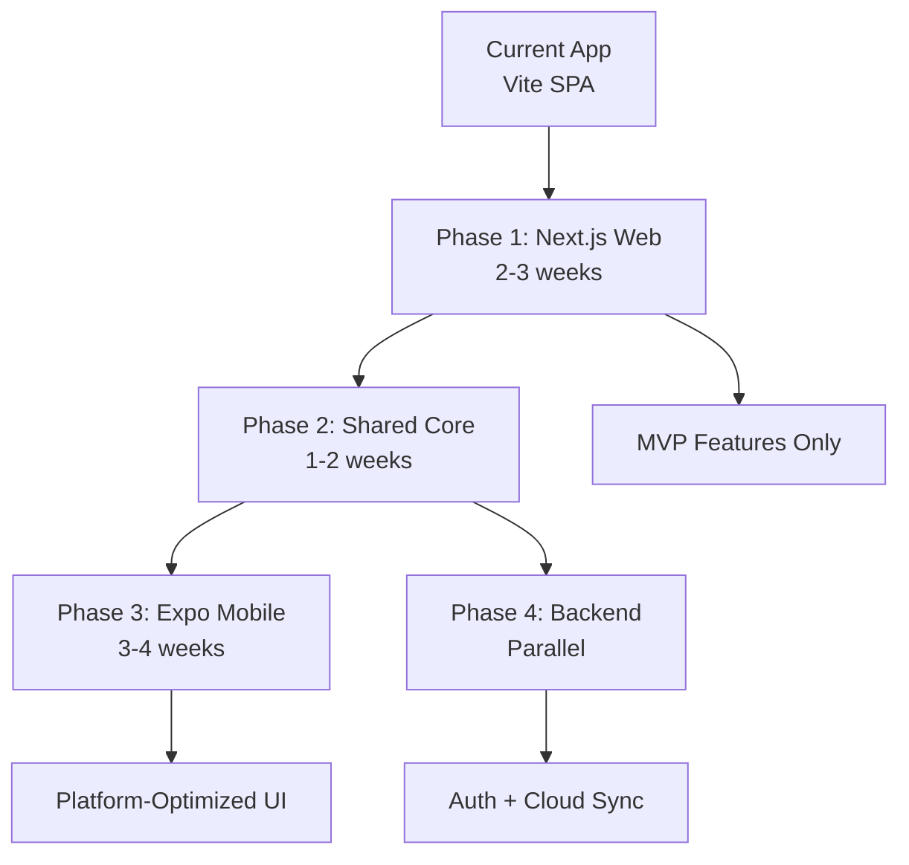
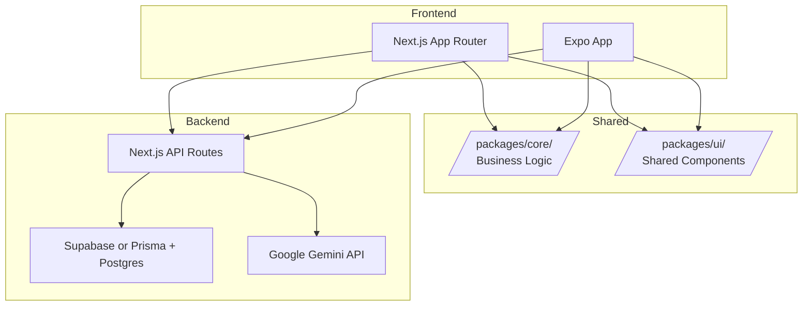
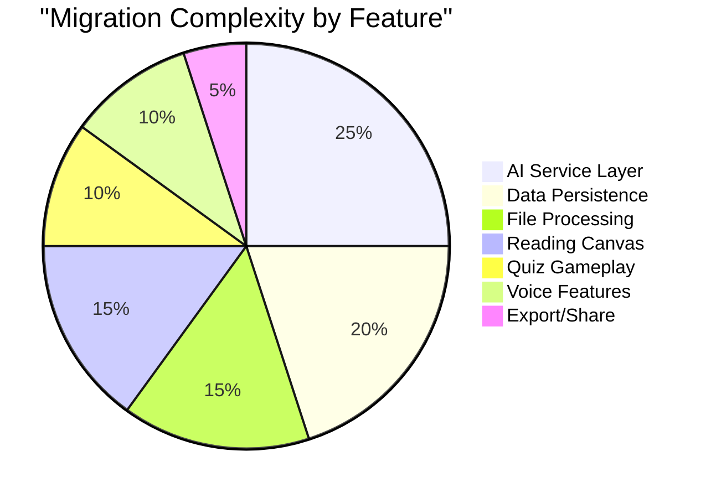
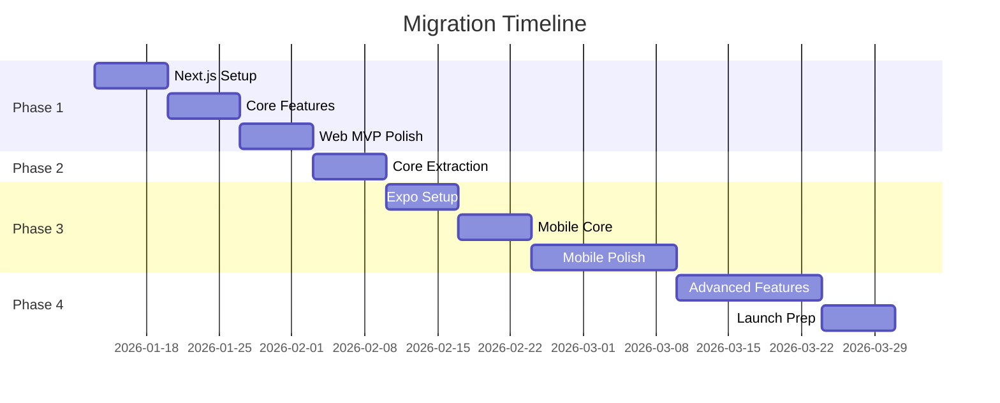

# Adaptive Study Game - Migration Analysis & Recommendations

> **Purpose**: This document provides a detailed analysis of migrating the Adaptive Study Game from the current Vite + React SPA to Next.js (web) and Expo (mobile), including my professional opinion on the approach.

---

## Table of Contents

1. [Executive Summary](#1-executive-summary)
2. [Migration Feasibility Assessment](#2-migration-feasibility-assessment)
3. [Architecture Recommendations](#3-architecture-recommendations)
4. [Platform-Specific Considerations](#4-platform-specific-considerations)
5. [Code Sharing Strategy](#5-code-sharing-strategy)
6. [Risk Analysis](#6-risk-analysis)
7. [Migration Roadmap](#7-migration-roadmap)
8. [Alternative Approaches](#8-alternative-approaches)

---

## 1. Executive Summary

### 1.1 My Professional Opinion

> [!IMPORTANT]
> **Yes, this migration is a GOOD idea**, but it requires a **strategic, phased approach** due to the significant complexity involved.

**The Case FOR Migration:**

| Factor | Current State | After Migration |
|--------|--------------|-----------------|
| **SEO** | ❌ None (SPA) | ✅ Full SSR/SSG |
| **Mobile UX** | ⚠️ Responsive web | ✅ Native feel |
| **Monetization** | ⚠️ Web only | ✅ App Store + Web |
| **API Security** | ❌ Exposed API keys | ✅ Server-side APIs |
| **Performance** | ⚠️ Large bundle | ✅ Code splitting |
| **Scalability** | ⚠️ Client-only | ✅ Server + Client |
| **User Data** | ❌ Browser-only | ✅ Cloud sync |

**The Reality Check:**

> [!WARNING]
> This is a **significant rewrite**, not a simple port. Expect:
> - 3-4 months of focused development time
> - Need for backend infrastructure (database, auth)
> - Re-architecture of AI service layer
> - Complete rethinking of data persistence

### 1.2 Recommended Approach



---

## 2. Migration Feasibility Assessment

### 2.1 What Transfers Easily (70%)

| Category | Items | Effort |
|----------|-------|--------|
| **Business Logic** | Quiz scoring, SRS algorithm, gamification | ✅ Minimal |
| **Type Definitions** | All TypeScript interfaces | ✅ Copy-paste |
| **AI Prompts** | All prompt templates | ✅ Copy-paste |
| **React Components** | Common UI (Modal, Tooltip, etc.) | ⚠️ Minor tweaks |
| **Custom Hooks** | State management hooks | ⚠️ Minor tweaks |
| **Animations** | Framer Motion patterns | ✅ Compatible |

### 2.2 What Requires Rework (30%)

| Category | Current | Next.js | Expo | Effort |
|----------|---------|---------|------|--------|
| **AI Service** | Client-side | Route Handlers | API calls | 🔴 High |
| **Database** | IndexedDB | Prisma + Postgres | SQLite/Supabase | 🔴 High |
| **File Processing** | Browser APIs | Server-side | Native pickers | 🔴 High |
| **PDF Rendering** | PDF.js canvas | React-PDF | react-native-pdf | 🟡 Medium |
| **Speech** | Web Speech API | Same | Expo Speech | 🟡 Medium |
| **Export** | html2canvas + jsPDF | Server PDF | Expo Sharing | 🟡 Medium |

### 2.3 Dependency Compatibility Matrix

| Package | Web (Next.js) | Mobile (Expo) | Alternative |
|---------|---------------|---------------|-------------|
| `@google/genai` | ✅ Server only | ✅ Via API | - |
| `framer-motion` | ✅ Native | ⚠️ Use `react-native-reanimated` | Moti |
| `idb` | ✅ Native | ❌ No IndexedDB | AsyncStorage, SQLite |
| `pdfjs-dist` | ⚠️ Complex | ❌ No Canvas | `react-native-pdf` |
| `mammoth` | ✅ Server only | ❌ Node.js deps | Expo DocumentPicker |
| `xlsx` | ✅ Works | ⚠️ Large bundle | Server-side processing |
| `html2canvas` | ✅ Works | ❌ No DOM | `react-native-view-shot` |
| `jspdf` | ✅ Works | ❌ No DOM | `expo-print` |

---

## 3. Architecture Recommendations

### 3.1 Recommended Stack



### 3.2 Monorepo Structure

```
adaptive-study-game/
├── apps/
│   ├── web/                    # Next.js application
│   │   ├── app/               # App Router pages
│   │   │   ├── (auth)/       # Auth routes
│   │   │   ├── (app)/        # Main app routes
│   │   │   │   ├── study/
│   │   │   │   ├── quiz/
│   │   │   │   ├── canvas/
│   │   │   │   └── stats/
│   │   │   └── api/          # Route handlers
│   │   │       ├── quiz/
│   │   │       ├── ai/
│   │   │       └── export/
│   │   └── components/       # Web-specific components
│   │
│   └── mobile/                # Expo application
│       ├── app/              # Expo Router (file-based)
│       ├── components/       # Mobile-specific components
│       └── hooks/            # Mobile-specific hooks
│
├── packages/
│   ├── core/                  # Shared business logic
│   │   ├── types/            # TypeScript types
│   │   ├── services/         # AI prompts, schemas
│   │   ├── hooks/            # Platform-agnostic hooks
│   │   └── utils/            # Pure utility functions
│   │
│   ├── ui/                    # Shared UI components
│   │   ├── primitives/       # Base components
│   │   └── composites/       # Complex components
│   │
│   └── database/             # Shared database schema
│       ├── schema.prisma
│       └── migrations/
│
├── tooling/
│   ├── eslint-config/
│   ├── typescript-config/
│   └── tailwind-config/
│
├── turbo.json                # Turborepo config
├── pnpm-workspace.yaml
└── package.json
```

### 3.3 Tech Stack Recommendations

**Monorepo Tooling:**
- **Turborepo** - Build orchestration
- **pnpm** - Fast, disk-efficient package manager

**Web (Next.js):**
- **Next.js 15** - App Router with RSC
- **Tailwind CSS 4** - Styling
- **Prisma** - Database ORM
- **NextAuth.js** - Authentication
- **Vercel** - Deployment

**Mobile (Expo):**
- **Expo SDK 52+** - React Native framework
- **Expo Router** - File-based navigation
- **NativeWind** - Tailwind for RN
- **Expo SQLite** - Local storage
- **EAS** - Build and submit

**Shared:**
- **Supabase** - Auth + Realtime + Storage
- **Zod** - Runtime validation
- **TanStack Query** - Data fetching

---

## 4. Platform-Specific Considerations

### 4.1 Web (Next.js)

#### Server vs Client Components

```typescript
// Current (all client-side)
const StudyScreen = () => {
  const [quiz, setQuiz] = useState(null);
  // ... all in one component
};

// Next.js Recommended Pattern
// app/quiz/[id]/page.tsx (Server Component)
export default async function QuizPage({ params }: { params: { id: string } }) {
  const quiz = await getQuiz(params.id); // Server-side fetch
  return <QuizClient quiz={quiz} />;
}

// components/QuizClient.tsx (Client Component)
'use client';
export function QuizClient({ quiz }: { quiz: Quiz }) {
  // Interactive logic here
}
```

#### AI Service Migration

> [!IMPORTANT]
> **API keys MUST move server-side.** This is non-negotiable for security.

```typescript
// Current: Client-side (INSECURE)
const client = new GoogleGenAI({ apiKey: process.env.API_KEY });

// Next.js: Server-side Route Handler
// app/api/ai/quiz/route.ts
export async function POST(request: Request) {
  const { content, config } = await request.json();
  
  const genAI = new GoogleGenAI({ 
    apiKey: process.env.GEMINI_API_KEY // Server-only
  });
  
  const quiz = await generateQuiz(genAI, content, config);
  return Response.json(quiz);
}
```

#### Database Migration

```typescript
// Current: IndexedDB
const studySets = await getAll('studySets');

// Next.js with Prisma
// lib/db.ts
import { PrismaClient } from '@prisma/client';

const prisma = new PrismaClient();

export async function getStudySets(userId: string) {
  return prisma.studySet.findMany({
    where: { userId },
    orderBy: { createdAt: 'desc' }
  });
}
```

### 4.2 Mobile (Expo)

#### Navigation Mapping

| Current Screen | Expo Route | Notes |
|----------------|------------|-------|
| `LandingPage` | `app/index.tsx` | Splash → Auth check |
| `SetupScreen` | `app/(tabs)/index.tsx` | Main tab |
| `StudyScreen` | `app/quiz/[id].tsx` | Full screen |
| `ExamScreen` | `app/exam/[id].tsx` | Full screen |
| `ResultsScreen` | `app/results/[id].tsx` | Dismissible |
| `ReviewScreen` | `app/review/[id].tsx` | Full screen |
| `StatsScreen` | `app/(tabs)/stats.tsx` | Tab |
| `ReadingCanvas` | `app/canvas/[id].tsx` | Full screen |
| `PredictionSetupScreen` | `app/predict/setup.tsx` | Modal |
| `PredictionResultsScreen` | `app/predict/[id].tsx` | Full screen |

#### Component Adaptations

```tsx
// Current: HTML + CSS
<div className="bg-gray-800 rounded-lg p-4">
  <h2 className="text-xl font-bold">Quiz</h2>
</div>

// Expo: React Native + NativeWind
import { View, Text } from 'react-native';

<View className="bg-gray-800 rounded-lg p-4">
  <Text className="text-xl font-bold">Quiz</Text>
</View>
```

#### File Handling

```tsx
// Current: Web File API
<input type="file" onChange={handleFileChange} />

// Expo: Document Picker
import * as DocumentPicker from 'expo-document-picker';

const pickDocument = async () => {
  const result = await DocumentPicker.getDocumentAsync({
    type: ['application/pdf', 'image/*'],
    copyToCacheDirectory: true
  });
  
  if (result.type === 'success') {
    // Upload to server for processing
    await uploadFile(result.uri);
  }
};
```

#### Speech Services

```tsx
// Current: Web Speech API
const recognition = new webkitSpeechRecognition();

// Expo: expo-speech + expo-av
import * as Speech from 'expo-speech';

// Text-to-Speech
Speech.speak('Hello, student!');

// Speech-to-Text (requires server)
// Use Whisper API or similar
```

---

## 5. Code Sharing Strategy

### 5.1 What to Share (Core Package)

```typescript
// packages/core/types/quiz.ts
export interface Quiz {
  questions: Question[];
  webSources?: WebSource[];
}

export type Question = 
  | MultipleChoiceQuestion 
  | TrueFalseQuestion 
  // ... etc

// packages/core/services/scoring.ts
export function calculateScore(log: AnswerLog[]): number {
  return log.reduce((sum, entry) => sum + entry.pointsAwarded, 0);
}

// packages/core/services/srs.ts
export function getNextReviewDate(currentStage: number, isCorrect: boolean): Date {
  const intervals = [0, 1, 3, 7, 14, 30, 60, 120];
  const newStage = isCorrect 
    ? Math.min(currentStage + 1, intervals.length - 1)
    : Math.max(currentStage - 2, 0);
  
  const date = new Date();
  date.setDate(date.getDate() + intervals[newStage]);
  return date;
}

// packages/core/prompts/quiz.ts
export function getQuizSystemInstruction(config: QuizConfig): string {
  // ... unchanged from current
}
```

### 5.2 What to Platform-Specific

```
apps/web/                          apps/mobile/
├── components/                    ├── components/
│   ├── FileUploader.tsx          │   ├── DocumentPicker.tsx
│   ├── PDFViewer.tsx             │   ├── PDFViewer.tsx (native)
│   └── VoiceInput.tsx            │   └── VoiceInput.tsx (expo-speech)
├── hooks/                         ├── hooks/
│   ├── useIndexedDB.ts           │   ├── useSQLite.ts
│   └── useWebSpeech.ts           │   └── useExpoSpeech.ts
└── services/                      └── services/
    └── export.ts (jsPDF)              └── export.ts (expo-print)
```

### 5.3 Shared UI Strategy

**Option A: Cross-Platform Library (Recommended)**

Use [Tamagui](https://tamagui.dev/) or [Gluestack UI](https://gluestack.io/) for truly shared components:

```tsx
// packages/ui/Button.tsx
import { styled } from 'tamagui';

export const Button = styled(Stack, {
  name: 'Button',
  backgroundColor: '$primary',
  borderRadius: '$lg',
  padding: '$4',
  
  variants: {
    size: {
      sm: { padding: '$2' },
      lg: { padding: '$6' },
    }
  }
});
```

**Option B: Platform Aliases**

Create platform-specific implementations with shared interfaces:

```tsx
// packages/ui/Button/index.ts
export { Button } from './Button';

// packages/ui/Button/Button.web.tsx
export const Button = ({ children, ...props }) => (
  <button className="btn" {...props}>{children}</button>
);

// packages/ui/Button/Button.native.tsx
import { Pressable, Text } from 'react-native';

export const Button = ({ children, ...props }) => (
  <Pressable style={styles.btn} {...props}>
    <Text>{children}</Text>
  </Pressable>
);
```

---

## 6. Risk Analysis

### 6.1 High-Risk Areas

| Risk | Impact | Mitigation |
|------|--------|------------|
| **AI Latency on Mobile** | Users expect instant feedback | Implement optimistic UI, caching, offline mode |
| **Large Bundle Size** | Slow mobile download | Aggressive code splitting, lazy loading |
| **File Processing on Mobile** | Limited native APIs | Server-side processing for complex files |
| **Data Migration** | Existing users lose data | Build migration tool from IndexedDB → Cloud |
| **Rate Limiting** | Shared API quota | Implement proper queueing + user-based limits |
| **PDF Rendering** | Different libs per platform | Accept visual differences, test thoroughly |

### 6.2 Complexity Hotspots



### 6.3 Breaking Changes

> [!CAUTION]
> **The following WILL break for existing users:**
> 
> 1. **Local data will NOT automatically migrate** - Users must export/import
> 2. **API key pool feature will be removed** - Users will need accounts
> 3. **Offline-first mode will change** - Cloud becomes source of truth

---

## 7. Migration Roadmap

### Phase 1: Next.js Foundation (Weeks 1-3)

```
Week 1:
├── [ ] Set up monorepo with Turborepo
├── [ ] Create Next.js app skeleton
├── [ ] Set up Prisma with Supabase
├── [ ] Implement auth with NextAuth/Supabase
├── [ ] Extract core types to shared package
└── [ ] Set up CI/CD pipeline

Week 2:
├── [ ] Migrate AI service to Route Handlers
├── [ ] Implement quiz generation API
├── [ ] Port SetupScreen (study set CRUD)
├── [ ] Port StudyScreen (quiz gameplay)
└── [ ] Implement basic persistence

Week 3:
├── [ ] Port ResultsScreen
├── [ ] Port ReviewScreen
├── [ ] Implement feedback generation
├── [ ] Add SRS functionality
└── [ ] Polish and test web MVP
```

### Phase 2: Core Package Extraction (Week 4)

```
Week 4:
├── [ ] Extract all types to packages/core
├── [ ] Extract AI prompts to packages/core
├── [ ] Extract scoring logic to packages/core
├── [ ] Extract SRS algorithm to packages/core
├── [ ] Create shared validation schemas (Zod)
└── [ ] Set up package build pipeline
```

### Phase 3: Expo Mobile App (Weeks 5-8)

```
Week 5:
├── [ ] Create Expo app skeleton
├── [ ] Set up Expo Router navigation
├── [ ] Configure NativeWind styling
├── [ ] Implement auth flow
└── [ ] Connect to shared API

Week 6:
├── [ ] Build mobile SetupScreen
├── [ ] Build mobile StudyScreen (quiz)
├── [ ] Adapt question type UIs for touch
├── [ ] Implement haptic feedback
└── [ ] Add gesture support

Week 7:
├── [ ] Build mobile ResultsScreen
├── [ ] Build mobile ReviewScreen
├── [ ] Implement mobile StatsScreen
├── [ ] Add push notifications (EAS)
└── [ ] Implement offline support

Week 8:
├── [ ] Port Reading Canvas (simplified)
├── [ ] Implement file picker + upload
├── [ ] Add voice features (expo-speech)
├── [ ] Polish animations (Moti/Reanimated)
└── [ ] Prepare for TestFlight/Internal testing
```

### Phase 4: Advanced Features (Weeks 9-12)

```
Weeks 9-10:
├── [ ] Exam prediction feature
├── [ ] PDF/DOCX processing (server-side)
├── [ ] Export functionality
├── [ ] Deep linking
└── [ ] Analytics implementation

Weeks 11-12:
├── [ ] Data migration tool (IndexedDB → Cloud)
├── [ ] Performance optimization
├── [ ] Accessibility audit
├── [ ] Beta testing
└── [ ] App Store submission
```

### Timeline Summary



---

## 8. Alternative Approaches

### 8.1 Option A: Next.js Only (No Native Mobile)

**Pros:**
- 50% less work
- PWA provides "app-like" experience
- Single codebase

**Cons:**
- No App Store presence
- Limited offline capabilities
- Worse mobile performance
- No native features (push, haptics)

**Verdict**: ⚠️ Viable for MVP, but limits growth potential.

---

### 8.2 Option B: Capacitor Instead of Expo

**Pros:**
- Share more web code
- Easier migration from existing web app
- Access to native plugins

**Cons:**
- Not truly native performance
- Larger app size
- Fewer mobile-specific libraries

**Verdict**: ⚠️ Good compromise if team is web-focused.

---

### 8.3 Option C: Flutter or Kotlin Multiplatform

**Pros:**
- Single codebase for both platforms
- Excellent performance
- Growing ecosystem

**Cons:**
- Complete rewrite (no React code reuse)
- Learning curve for new language
- Lose React ecosystem benefits

**Verdict**: ❌ Not recommended given existing React expertise.

---

### 8.4 Option D: Stay Web-Only, Optimize for Mobile

**Pros:**
- Minimal effort
- Already deployed
- Focus on features

**Cons:**
- Poor mobile UX
- No offline
- SEO still limited
- API keys exposed

**Verdict**: ❌ Technical debt will compound.

---

## Final Recommendation

> [!TIP]
> **Go with the Next.js + Expo approach** using a monorepo structure. This provides:
> 
> 1. **Maximum code reuse** - 60-70% shared core
> 2. **Native mobile experience** - Critical for education apps
> 3. **Secure API handling** - No exposed keys
> 4. **Monetization paths** - App Store + subscriptions
> 5. **SEO for growth** - Organic web traffic
> 6. **Future-proof architecture** - Scales with your ambitions

---

## Questions?

Before proceeding, consider:

1. **Do you have a Supabase or other database provider set up?**
2. **What's your timeline pressure?** (Affects MVP scope)
3. **Will you need user authentication from day one?**
4. **Are there features you want to drop for the initial port?**
5. **Do you have Apple Developer and Google Play accounts ready?**

---

> _Document generated: 2026-01-06_  
> _For the complete feature inventory, see [feature_documentation.md](file:///C:/Users/johno/.gemini/antigravity/brain/b7afc264-c2d9-4f89-8b9e-a57a91827c4a/feature_documentation.md)_
